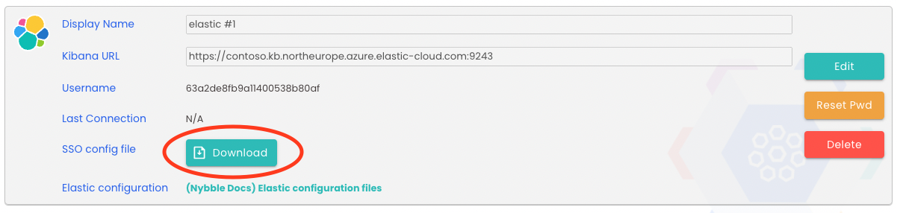

# Elastic Configuration
!!! note 
    This documentation suits only for Bring Your Own SIEM (BYOS) customers.  
    If you are an Elastic By Nybble customer, all configurations are already done.

## Overview
Nybble analysts and hunters requires an access to your SIEM in order to complete their investigations.  
This access is limited:  

 * dedicated space, with access to specific features
 * restricted role, where you can restrict indexes

On top, we're connecting our SSO solution to your cluster, avoiding account management on your side. Our SSO is MFA enabled and restricted to the specific space.

## Nybble dedicated space
```json
POST kbn:/api/spaces/space
{
  "id": "nybble",
  "name": "Nybble",
  "description": "Dedicated space for Nybble detection rules, analysts and hunters.",
  "initials": "",
  "color": "#FFFFFF",
  "disabledFeatures": [
    "maps",
    "enterpriseSearch",
    "logs",
    "infrastructure",
    "apm",
    "uptime",
    "observabilityCases"
  ],
  "imageUrl": "data:image/png;base64,iVBORw0KGgoAAAANSUhEUgAAAEAAAAA+CAYAAACbQR1vAAAAAXNSR0IArs4c6QAACMNJREFUaEO9W8txG0cQfQ2VZd1MgAGIikBkBAIjEBmBoYNF3khFICoCgzeCPhiOwGQEhiIwGIGpAEQAN4JV2nH1zu7O/7MAiK1SlUranZl+3dP9+gPCtp7T2R6E+BfATmLLOYgOcNW938bRaBublHucPNwAeJ+53w1GvePMd9d6bTsAnM76EOKfViclOsRVd9LqmxVe3g4AHx/uQXhdne8OROfesxZirL13j1HvzQoytfrk+QE4/X4BQZ+bU8U0a1sKiS+42r1oJVHLl58XANvxkfgLV7uD6BlNX/HsDvGZAfg+hqBfK4EXINpPencJ2hTAL+V3OaC11Lr++vMBsI45t7k2awhf4pv1/W+zfXTE7wDmEDQFYY4CU7zAt6BGT2cDCPFns76gY1x3ORSmH/tbog+46o69Hw5mO/gJb0HYA7AHEvsl1yjoE/7osiVFnzQAvMHPZQjjhUMPb8TgXBpCnj5MIPCu+ugeSzrAuDuPnkjux4SJBWIVfcVVr99883F2BBJ8rZhQqX93F51iSYep/dIAtCMwc4x63eYs0nJYGPnkeHXb/As6MDR58sAASv+QfpKEKg6AfRjgttLKjqZZ8xi2uZ58HwJ0pkCgN5Frww7wP7WguMRoV3EGqf2/A3LflVdTgAFSjDMBehgAd7M7jHrmNWBzfcVXQ1xogNxi1DtqDilNmnl9rbUJRr1DrxDmlVlgSXuGCevWyFcDxBzh3gH05IGv5Ntmj4j/8QMgTZfvfZ24uIfRJbDBIkvLH2fnoNKJ5j+CPuG6O2w+kOFRWUfKMZqgz1HQoc8pugD4nJ59D31i6HfTZ3a2VuJQuNZmgrjAqBfPKm3/A3idogvAqUFegBjSuhDmXXd5fJuEyEeXjXzC8g0hMO1wyj5Mv55eHmAibXr1mNZcE3WzOdbKi0Q94Afmjqna4OVYZH3WhGWGrsBM89phEmIDopv5JimsaZXu9ci1ANs3BZmgGfvDXlvf2GFvFoHJd3/umzYXyb6WRhHGMX/eyB8FUl7dPqIdNQS+4Yn2UywsGxPpmLk4Uoe2oFdvGzUiPEArYsTIhE1dgQUK6ufw8GwA+EUJMoNQ84k4tTZJXDBqhAGwvTpo6E2AWpCOVgL7XnbJmXk92RH/wGt0SnLGDFLmEwhHjTAAtld3D8TsjmmnYocxS2ENUmZRVOA2aEEuPa8zvnCy5nF+tTiJXMDI5lIK9DqZ5qN2RGiKUe8guGG7BC0aNRIAzPpA0Ycg1l44AQLusKR+0OltggrraLhO0cSK8wROiogrS51JrLqcTod9amBiUmAHnYLNbg8/OsOgycrDModPNUTsneZY0psgqNIpXlRC8nW8xyOmbSPPagCkLoPBDyxqbSc5+ru2pWySTAXOHAZAOq23eMJtW1S1WGw2RJgfXPcqzxw4kdlDANrQXntJtr6XeA+Bu5CF+gGQrI7T19psJwDdgHCbrOoa2recaE63x02a8phovS9HrwLvQIJrEnVdgst1H3w1SU82aBUzXUVNARqjwNco2cnIxLK9fIr6liGbQ6zgnkMsHDp5jQmAe+jUbfe3r1zHl9cT0LWo9waYb4QcYrvw6qT3CgBXeElpudzcKY6qv9f9PQWM746mGFsKVv5/szwG+MpabtGjXnkBEjcoOrIMT4JL6qqQqlmUBMAugoT4fLlhMQCITU0uGPLqtgA5919ZgOk87dK4ek/vPSwAMYboTJy77uYRjMo5Rt1LyhY+FNpCocrVTn63144EIfB0xaVCphcEMSbYreuCBslMzozXYcFsy4pxgBrgNlxAP3vO2jYIAt9MC0ihWB/SaXgEav1uSTzO7nzO0y6N12eQ76rKVS5fsKyGkKtN23HptbZY38/NA25QkCp36+t2yhRW9RTirFFvkqSrxI2FaXUOQZ+oKjRo7atI5yZIchJV2rahSu4Tr/3p9YqQk7SVZqf4BR3IKJCrzaAjTNT/2pTE6z1SUcOIMpllcjM8l1ZThUGdsmYs5gubqUaF+02YDeT4IqdJKsNalGJ4rKbmAfoczxREx+EGppXd5dYAmz5iBgvKSWsDYQ2j3Q/eHeyOV1W9qgDwjrFJzq8nQK4WeeLrqFWClCF/9isSBGZ5qhHKZKgGQeUIPEegnGvJDuUYnqLCJw8isrEcgDAHEuJVoGwp1nzRXx1iCsxpdzgxGvVK2RUA7CCY8wtipFIDCGHhOezx90+4XLmOYGMi8/qzsv/vu+epEplaT+UI1bhOpD1eDEow1ICjXIZDziMdOcLJEMMzQfXYCufgw7WAaAQv+YGqTchkxpwlDoHARRhOjHw5QtaQlEqA+mX9zTfnJ8kOD0MG6n48Adr5ku0rSjCLsyrp8q05L4cjbGsoHW0xlJlrmQ2OU7R+vZqgq/XEhU4AIQX/XAme4xwmVft+5cny1QHwa30BQRd4whivinOIcibY9Se+Borb8KgB4Hs7xGNniJcYgASPxehr+q0hB76sK+BbyEdq5MzOwDBzaZIuED7qatcPmF/UguujdWwlZd7fjN9VviljDNcjy2oWYA8zsdb1eZ4UaCkAmAk+ds6jUURaoLKG3HzAOtv6AOTM/vGmZj7g1hB0HpLKA2oh9GuzXQA0OrwaAEBFRBqFrAKA0cHOyGE2dwW03wDkIm9nhDEAsosbWhKXq4jNXIEVAOCNTS2ridEUOCGPrvui7QKgNU9yLcAFQE2RrQqAXmhpM42uAbqiE7SyxyV1k7w/9hsAp2CSkdvHAM3kAGYy1OIjy6Pzl2HeL1NWzhHMzEzXmH9+wM/y/PlBk962EWMdAKyp7mZbEwg/u2O2OHCaF3Zcl0sqlhcSvN46xwo3FgVkXN8DCq4k1b8J0pfn2gH/sVvht1jSIHhdQiyP53zlWm5ixKQJnYvsRGsjUUBfRAERqyP4tR6yV781mG+vKXi92GpO0HfwEO/nAeWY1oMhzsv5/flB24u/dhSIbVgDwS02bkDm/lAqZg0888e1P84IU785agnG/+EQgO/8sfBYAAAAAElFTkSuQmCC"
}
```

## Nybble SSO

### Elastic configuration

1. From the Hub, grab the elastic SSO yaml file available in the connectors section (Admin -> connectors):{: style="width:800px;"}
2. Import the yaml file in your Elastic organization (cloud):  
Deployments -> `deployment name` -> edit -> elasticsearch -> manage user settings and extensions

### Kibana configuration
Import this yaml file in your Elastic organization, kibana settings:

```yaml
xpack.security.authc.providers:
  saml.saml1:
    order: 100
    realm: nybble
    description: "Log in with Nybble Auth"
    hint: "Nybble Hunters and Analysts"
    icon: "data:image/svg+xml;base64,PHN2ZyBpZD0iTGF5ZXJfMSIgZGF0YS1uYW1lPSJMYXllciAxIiB4bWxucz0iaHR0cDovL3d3dy53My5vcmcvMjAwMC9zdmciIHZpZXdCb3g9IjAgMCAxODMuMzEgMTc4Ljc0Ij48dGl0bGU+TnliYmxlLUxvZ28tMjAweDIwMDwvdGl0bGU+PHBvbHlnb24gcG9pbnRzPSI3OS41MiAxMTAuODQgNjcuNDYgOTAuMzYgNzkuNTIgNjkuODggMTAzLjggNjkuODggMTE1Ljg2IDkwLjM2IDEwMy44IDExMC44NCA3OS41MiAxMTAuODQiIHN0eWxlPSJmaWxsOm5vbmUiLz48cGF0aCBkPSJNOTAuNzIsODRoMTguNTZsOS4xMiwxNS40OEwxMDkuMjgsMTE1SDkwLjcyTDgxLjYsOTkuNDgsOTAuNzIsODRNODUsNzQsNzAsOTkuNDgsODUsMTI1aDMwbDE1LTI1LjQ4TDExNSw3NFoiIHRyYW5zZm9ybT0idHJhbnNsYXRlKC04LjM0IC05LjEyKSIgc3R5bGU9ImZpbGw6IzAwNjdlZSIvPjxwb2x5Z29uIHBvaW50cz0iODAuNTMgNDAuMTMgNjkuNDggMjEuMzYgODAuNTMgMi41OCAxMDIuNzkgMi41OCAxMTMuODQgMjEuMzYgMTAyLjc5IDQwLjEzIDgwLjUzIDQwLjEzIiBzdHlsZT0iZmlsbDpub25lIi8+PHBhdGggZD0iTTkxLjQ5LDE4LjI5aDE3bDguMzYsMTQuMTktOC4zNiwxNC4xOWgtMTdMODMuMTMsMzIuNDhsOC4zNi0xNC4xOU04Ni4yNSw5LjEyLDcyLjUsMzIuNDgsODYuMjUsNTUuODRoMjcuNUwxMjcuNSwzMi40OCwxMTMuNzUsOS4xMloiIHRyYW5zZm9ybT0idHJhbnNsYXRlKC04LjM0IC05LjEyKSIgc3R5bGU9ImZpbGw6IzAwNjdlZSIvPjxwYXRoIGQ9Ik0zMC44Miw1NS43LDQxLjQzLDQyLjRsMTYuMzEsMi4zMSw1Ljg3LDE1LjM4TDUzLDczLjM5LDM2LjcsNzEuMDgsMzAuODIsNTUuN00yMC4zOCw1NC4wOGw5LjY5LDI1LjMxTDU2LjksODMuMjFsMTcuMTUtMjEuNUw2NC4zNywzNi40LDM3LjUzLDMyLjU4WiIgdHJhbnNmb3JtPSJ0cmFuc2xhdGUoLTguMzQgLTkuMTIpIiBzdHlsZT0iZmlsbDojMDA2N2VlIi8+PHBhdGggZD0iTTIyLjIyLDEyNi40NWwtMy43OC0xNi41OSwxMi0xMS4zLDE1LjY5LDUsMy43OCwxNi41OS0xMiwxMS4zLTE1LjctNW0tNy43Nyw3LjE1LDI1LjgzLDguMjJMNjAsMTIzLjIyLDUzLjg5LDk2LjQxLDI4LjA2LDg4LjE5LDguMzQsMTA2Ljc5WiIgdHJhbnNmb3JtPSJ0cmFuc2xhdGUoLTguMzQgLTkuMTIpIiBzdHlsZT0iZmlsbDojMDA2N2VlIi8+PHBhdGggZD0iTTcyLjE4LDE3Ny4zbC0xNS4zMy03LjM5TDU1LjQ4LDE1My41bDEzLjctOS4xNiwxNS4zMiw3LjM5LDEuMzcsMTYuNDJMNzIuMTgsMTc3LjNtLjc0LDEwLjUzLDIyLjUzLTE1LjA3LTIuMjQtMjdMNjguNDMsMTMzLjgxLDQ1LjkxLDE0OC44OGwyLjI0LDI3WiIgdHJhbnNmb3JtPSJ0cmFuc2xhdGUoLTguMzQgLTkuMTIpIiBzdHlsZT0iZmlsbDojMDA2N2VlIi8+PHBhdGggZD0iTTE0My4wOCwxNzBsLTE1LjM0LDcuMzgtMTMuNjgtOS4xNywxLjM4LTE2LjQxLDE1LjM0LTcuMzcsMTMuNjgsOS4xNkwxNDMuMDgsMTcwbTguNjksNiwyLjI3LTI3LTIyLjUxLTE1LjA5LTI0Ljc4LDExLjkyLTIuMjcsMjdMMTI3LDE4Ny44NloiIHRyYW5zZm9ybT0idHJhbnNsYXRlKC04LjM0IC05LjEyKSIgc3R5bGU9ImZpbGw6IzAwNjdlZSIvPjxwYXRoIGQ9Ik0xODEuNTUsMTEwbC0zLjgsMTYuNTgtMTUuNyw1LTEyLTExLjMxLDMuOC0xNi41OSwxNS43LTUsMTIsMTEuMzJtMTAuMS0zLjA2TDE3Miw4OC4yN2wtMjUuODQsOC4xOUwxNDAsMTIzLjI2bDE5LjcsMTguNjIsMjUuODMtOC4xOVoiIHRyYW5zZm9ybT0idHJhbnNsYXRlKC04LjM0IC05LjEyKSIgc3R5bGU9ImZpbGw6IzAwNjdlZSIvPjxwYXRoIGQ9Ik0xNTguNjMsNDIuNDZsMTAuNiwxMy4zMS01LjksMTUuMzhMMTQ3LDczLjQ0LDEzNi40Myw2MC4xM2w1Ljg5LTE1LjM4LDE2LjMxLTIuMjltMy45MS05LjgxTDEzNS43LDM2LjQzLDEyNiw2MS43NGwxNy4xMywyMS41MUwxNzAsNzkuNDdsOS43MS0yNS4zMVoiIHRyYW5zZm9ybT0idHJhbnNsYXRlKC04LjM0IC05LjEyKSIgc3R5bGU9ImZpbGw6IzAwNjdlZSIvPjwvc3ZnPg=="
```

## Nybble role and rolemapping

### Nybble role
Use the elastic dev console to import the `nybble_analyst_hunter` role:

```json
POST _security/role/nybble_analyst_hunter
{
    "cluster": [],
    "indices": [
      {
        "names": [
          "logs-*"
        ],
        "privileges": [
          "read",
          "read_cross_cluster",
          "view_index_metadata"
        ],
        "field_security": {
          "grant": [
            "*"
          ],
          "except": []
        },
        "allow_restricted_indices": false
      },
      {
        "names": [
          ".*-nybble"
        ],
        "privileges": [
          "write",
          "read",
          "view_index_metadata",
          "maintenance",
          "manage"
        ],
        "field_security": {
          "grant": [
            "*"
          ]
        },
        "allow_restricted_indices": false
      }
    ],
    "applications": [
      {
        "application": "kibana-.kibana",
        "privileges": [
          "feature_discover.all",
          "feature_dashboard.all",
          "feature_canvas.all",
          "feature_maps.all",
          "feature_graph.all",
          "feature_visualize.all"
        ],
        "resources": [
          "space:nybble"
        ]
      }
    ],
    "run_as": [],
    "metadata": {},
    "transient_metadata": {
      "enabled": true
    }
  }
```

### Nybble rolemapping
Use the elastic dev console to import the `nybble_analyst_hunter_role_mapping` role mapping:

```json
POST _security/role_mapping/nybble_analyst_hunter_role_mapping
{
    "enabled": true,
    "roles": [
      "nybble_analyst_hunter"
    ],
    "rules": {
      "all": [
        {
          "field": {
            "realm.name": "nybble"
          }
        },
        {
          "field": {
            "groups": "*"
          }
        }
      ]
    },
    "metadata": {}
  }
```