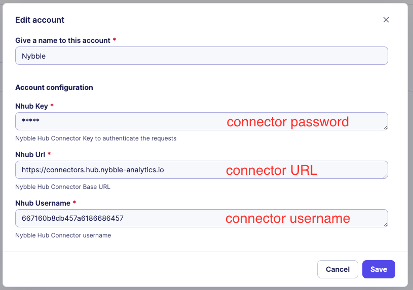

{: style="width:800px;"}

# How to setup a Sekoia Connector

## Overview
Follow this page to send alerts from Sekoia.IO to Nybble Hub.  
It requires a Hub connector, Sekoia playbook and SSO for our analysts (with restricted role).  

## 1. Sekoia: Start SSO configuration
!!! note
    Sekoia SSO documentation : https://docs.sekoia.io/getting_started/sso/openid_connect/

Our analysts will use SSO to connect to your Sekoia community.  
Our usernames always finishes by `@nybble.bzh` so you have to validate this domain.

After validation, copy the `Single Sign-on URL` (usually `https://app.sekoia.io/user/oidc/<some_uuid>`), it will be used to create the Nybble connector.  

It also requires a custom, specific role to restrict Nybble analysts to accurate permissions.  
Create a role called `nybble_analysts` with following permissions :

{: style="width:500px;"}

## 2. Nybble Hub connector

1. Connect to Nybble Hub using your usual credentials
2. Go to Settings > Connectors
3. Add a Sekoia connector then fill the form:

    | Field | Explanation | Usual value |
    | ------ | ----------- | -------- |
    | Display Name | name to display during authentication and in hub configs | `sekoia` |
    | SSO Login URL | sekoia specific URL for SSO (previous step) | `https://app.sekoia.io/user/oidc/<some_uuid>` |

4. Click on Save

    !!! warning
        At this stage, connector password will be generated and available in a popup.  
        Be sure to copy and store this password in a secure location as it will not be displayed anymore !  
        You can always reset it afterwards, but you will have to update the sekoia account with the new value.

5. Download the SSO configuration file.

## 3. Sekoia: Finish SSO configuration

1. Fill the rest of the Sekoia SSO configuration:

    | Field | Explanation | Value |
    | ------ | ----------- | -------- |
    | Create account | To create Nybble accounts at 1st connection | `Yes` |
    | Role by default | Custom restricted role | `nybble_analysts` |
    | SSO configuration > Authentication Provider URL | Nybble SSO URL | `https://auth.nybble-analytics.io/` |
    | SSO configuration > Client ID | Hub connector clientID | see downloaded file |
    | SSO configuration > Client Secret | Hub connector client secret | see downloaded file |

2. Click on Save Changes.

## 4. Sekoia : playbook

Nybble has developed a sekoia integration:

- playbook template
- playbook action : send alert

### Account
1. Go to Playbooks -> Accounts -> new, and search for Nybble
2. Fill the form with:

{: style="width:600px;"}

### Playbook

!!! note
    For each alert you will send to Nybble, please contact our Professional Services  
    They will confirm the proper integration of the Sekoia rule in Nybble Hub, especially for custom rules.

1. Go to Playbooks -> New Playbook -> use a template -> search for nybble
2. Configure the step `Alert Created` by defining the Trigger Configuration
3. Select the appropriate account(s) per each step
4. Save and activate
