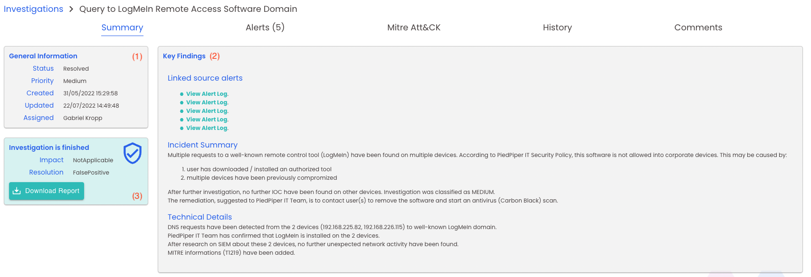
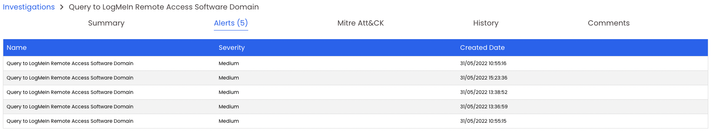
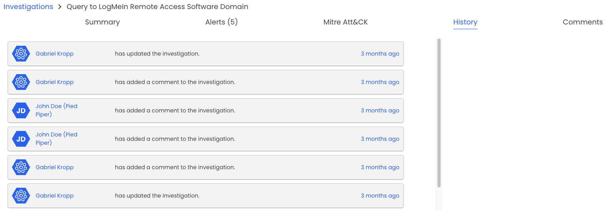
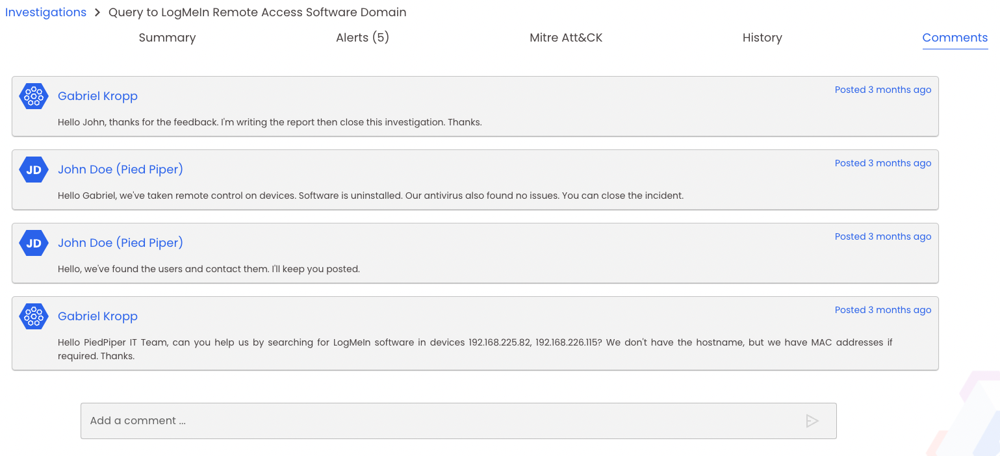

# Investigations
!!! note 
    A client or L2 analyst profile is required to follow this documentation

## Investigation main table

Here you have an overview of all investigations done by Nybble.  
By default, this table is ordered by update time, to display you the freshest investigations first. You can filter this table by clicking on the header icons:

- {style="position:relative;top:5px"} to open a filter box with available values
- {style="position:relative;top:5px"} to change the display order

You can click on the investigation name to display its details.

## Investigation details

### Summary

The summary panel is divided into 3 blocks:  
(1) General Informations: gives you some timestamp informations, status, priority, and which L2 analyst is in charge of the investigation  
(2) Key findings: summary of the investigation with key informations. More details on the report  
(3) Finished panel: visible only if an investigation is finished, it gave you the final status and allows you to download the detailed report.

### Related Alerts

This table summarizes which alerts have been correlated and investigated. Usually multiple alerts are correlated as an attack scenario.

### Mitre Att&CK diagram

[Mitre Att&CK](https://attack.mitre.org/) is a knowledge base of adversary tactics and techniques. It helps to represent and classify observations made to better understand and answer to the threat.  
Nybble is classifying every found technic using this definition, and represent them on a diagram, based on an attack timeframe:

- usually, tactics at left are considered as first steps of an attack scenario (network reconnaissance, tooling)
- tactics at right are considered as the end of an attack scenario (with the final goals: impact or exfiltration). 

In short, **higher the right numbers are, higher the impact is, more successful was the attack scenario**.

### History

This tab displays a timeframe of any actions done by the client or any Nybble analyst on this investigation.

### Comments

Here you can read any comments / interrogations written by the analyst in charge of the investigation (newest in first).  
You can also interact by posting a comment / question which will be read and answered by Nybble.  
Usually, it permits to mvoe forward on investigation by providing further infos without sending multiple mails / calls, everything is summarized on a single page.